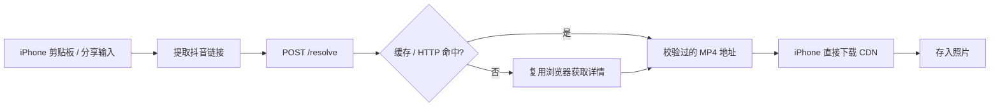

# TikTok Downloader · 抖音 iOS 快捷指令

复制抖音分享链接 → 运行快捷指令 → 自建 API 解析 → iPhone 下载并存入「照片」。也可从分享菜单运行。

也可启用私人 Telegram Bot：把链接或完整分享文案发给 Bot，它会返回可点击的 MP4 下载地址和“重新获取”按钮。Bot 与 Shortcut 共用解析器；视频仍由手机直接从 CDN 下载。配置方法见 [Telegram Bot 说明](docs/telegram-bot.md)。

当前支持中国版抖音的公开视频，接受网页 URL、手机短链接和完整分享文案。国际版 TikTok、图文、直播、私密或下架作品不在支持范围。精选首页本身不是单条视频链接，需带 `modal_id`。

```text
https://www.douyin.com/jingxuan?modal_id=7688235974236654911
https://v.douyin.com/p-rXmps4nWc/
9.92 复制打开抖音，看看【晓辉博士的作品】… https://v.douyin.com/p-rXmps4nWc/ …
```

## 浏览器不是每次请求的必需步骤

默认 `auto` 模式：**HTTP 优先 → 短期缓存 → 必要时复用浏览器兜底**。HTTP 未命中目标视频或 CDN 校验失败时，才让浏览器加载详情页。浏览器懒启动，每个后端进程最多一个；后续复用浏览器与匿名会话，每次任务只创建并关闭一个标签页。缓存默认 45 秒，同一视频的并发解析会合并。



`http` 模式完全不安装或启动浏览器，但覆盖率较低。2026-09-24 实测，手机分享样例走 HTTP 成功；网页版样例需浏览器兜底。浏览器用于执行网页逻辑与维护匿名会话，不需要导入个人 Chrome Cookie。实测和边界见 [解析研究](docs/resolver.md)。

## 后端部署

提供 Python / FastAPI 应用、Dockerfile 和 Compose。默认方案适合能运行常驻 Docker 容器的后端；仅 HTTP 版本有单独的轻量镜像。

```sh
cp .env.example .env
python -c "import secrets; print(secrets.token_urlsafe(32))"
# 将生成值填写为 .env 中的 DOUYIN_API_TOKEN
docker compose up -d --build
curl http://127.0.0.1:8000/health
```

再通过主机的 HTTPS 反向代理或托管平台的 HTTPS 域名接入。快捷指令里填写 **`https://你的域名/resolve`** 和相同 Token。Compose 默认只把端口绑定到主机本地。不要将手机上的 `127.0.0.1` 当成服务器地址。

详细环境变量、纯 HTTP 镜像、Python 本地启动和 API 合约见 [部署说明](docs/deployment.md)。本仓库不提供公共解析服务器；你可以托管一个后端给自己的手机使用。

## 新版快捷指令

仓库中的 [src/TikTok Downloader.shortcut](src/TikTok%20Downloader.shortcut) 是**新版未签名构建产物**。可阅读的 [plist 源文件](src/TikTok%20Downloader.plist) 和 [构建脚本](scripts/build_shortcut.py) 一并开放。旧版已保存在 `src/legacy/`；原先的 iCloud 分享链接仍指向旧版，不代表此次更新。

在你的 Mac 上，从仓库根目录执行：

```sh
sh scripts/sign_shortcut.sh
```

这会用系统自带的 `shortcuts sign` 生成 **`dist/TikTok Downloader.shortcut`**。将它 AirDrop 到 iPhone 并导入，按导入问题填写 API 地址和 Token。Mac 只用于签名，日常运行全部在 iPhone 上；后端在你部署的服务器上。签名命令、手动搭建步骤和发布流程见 [快捷指令说明](docs/shortcut.md)。

首次运行允许访问后端、视频 CDN 和添加照片。新版通过 JSON 字段读取地址，携带返回的 User-Agent / Referer 下载视频；API Token 只发给后端。保存成功后通知，缺少链接或解析地址时停止。

## 开发与验证

Python 3.10+；建议使用 3.12。

```sh
python -m venv .venv
# macOS/Linux: source .venv/bin/activate
# PowerShell: .venv\Scripts\Activate.ps1
python -m pip install -e '.[browser,test]'
python -m playwright install chromium
python -m unittest discover -s tests -v
python scripts/build_shortcut.py
```

CLI 可独立使用：

```sh
douyin resolve '完整分享文案或视频链接' --engine http
douyin download 'https://www.douyin.com/jingxuan?modal_id=7688235974236654911' --channel chromium
```

离线测试已覆盖解析服务、Shortcut 和 Telegram Bot。两个用户样例已通过新版 API 完整下载并用 ffprobe 验证 H.264 + AAC；重复解析只启动一次浏览器。两种 Docker 镜像均完成构建、启动、鉴权和真实解析检查；Linux / Chromium 兜底及容器外读取返回的 MP4 地址也通过。实体 iPhone 导入、保存照片，以及 Telegram 手机端点击下载仍需验证。GitHub Actions 已配置离线测试、快捷指令构建一致性及镜像启动检查，尚未在远端运行。

MIT 许可证。发布给其他人时分发签名后的空配置模板，各自填写后端配置；不要在公开快捷指令中嵌入你自己的 Token。
